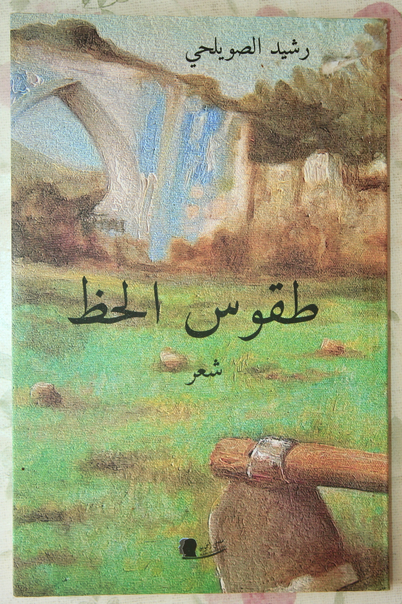

# 🎯 طقوس الحظ — دليل الموقع الكامل

مرحباً! هذا الدليل سي帮助你 في تخصيص وتعديل موقع ديوان "طقوس الحظ" بكل سهولة.

---

## 📋 المحتويات

1. [تغيير الألوان](#-تغيير-الألوان)
2. [تغيير الصور](#-تغيير-الصور)
3. [تخصيص النصوص](#-تخصيص-النصوص)
4. [روابط التواصل](#-روابط-التواصل)
5. [التحميل والنشر](#-التحميل-والنشر)

---

## 🎨 تغيير الألوان

### الموقع يستخدم نظام_vars_css متقدم يدعم الوضع الفاتح والداكن.

#### للوضع الداكن (الافتراضي):

ابحث في الكود عن هذا الجزء:

```css
:root {
  --bg:          #07070f;        /* ⬅️ الخلفية الرئيسية */
  --bg-2:        #0d0d1e;        /* ⬅️ الخلفية الثانوية */
  --gold:        #e8c84a;        /* ⬅️ الذهبي اللامع */
  --gold-dim:    #c9a227;        /* ⬅️ الذهبي المخفف */
  --text-1:      #f6f2e8;        /* ⬅️ النص الرئيسي */
  --text-2:      #c9c4b5;        /* ⬅️ النص secondaire */
}
```

#### للقيم المقترحة للألوان:

| العنصر | الوضع الداكن | الوضع الفاتح | الكود |
|-------|-------------|-------------|-------|
| الخلفية | أسود داكن | أبيض دافئ | `#07070f` / `#fdf8ef` |
| الذهبي | أصفر ذهبي | بني داكن | `#e8c84a` / `#7a4f00` |
| النص | أبيض مائل للأصفر | أسود داكن | `#f6f2e8` / `#0d0a05` |

#### مثال عملي:

**لتغيير اللون الذهبي إلى الأخضر مثلاً:**

```css
/* استبدل هذا الكود */
--gold:        #e8c84a;

/* بهذا */
--green:      #2ecc71;
/* أو أي لون تختاره مثلاً: #27ae60, #16a085, #1abc9c */
```

---

## 🖼️ تغيير الصور

الموقع يعتمد على 4 صور أساسية:

### 1. صورة الغلاف (Hero)
```html

```
**الأسلوب المطلوب:** صورة عالية الجودة (1920x1080 على الأقل)

### 2. صورة الشاعر
```html

```
**الأسلوب المطلوب:** صورة شخصية أو بورتريه مربعة

### 3. غلاف الديوان
```html

```
**الأسلوب المطلوب:** غلاف الكتاب بدقة عالية

### 4. ملف PDF
```html
<a class="btn-primary" href="diwan.pdf" download>
```
**الأسلوب المطلوب:** ملف بصيغة PDF

---

## 📝 تخصيص النصوص

### عناوين الصفحات:

```html
<!-- العنوان الرئيسي في الhero -->
<h1 class="hero-title">طقوس الحظ</h1>

<!-- العنوان الفرعي -->
<p class="hero-subtitle">رحلةٌ بين المعنى والقدر...</p>
```

### النصوص الشخصية:

```html
<!-- اسم الشاعر -->
<h2 class="section-title">رشيد الصويلحي</h2>

<!-- الوصف -->
<p>شاعر مغربي ينحت كلماته...</p>
```

### القصائد:

كل قصيدة موجودة في عنصر `<div class="poem-card">`:

```html
<div class="poem-card">
  <span class="poem-number">١</span>      <!-- ⬅️ رقم القصيدة -->
  <p class="poem-text">نص القصيدة...</p>
  <div class="poem-full">البيت supplémentaires...</div>
</div>
```

---

## 🔗 روابط التواصل

ابحث في نهاية الملف عن قسم `<footer>`:

```html
<div class="footer-col">
  <h4>تابعنا</h4>
  <ul>
    <li><a href="رابط إنستغرام">إنستغرام</a></li>
    <li><a href="رابط فيسبوك">فيسبوك</a></li>
    <li><a href="رابط يوتيوب">يوتيوب</a></li>
    <li><a href="رابط تيك توك">تيك توك</a></li>
  </ul>
</div>
```

**فقط استبدل `#` بالرابط الحقيقي!**

---

## 📤 التحميل والنشر

### الطريقة الأولى: GitHub Pages (مجاني)

1. أنشئ repository جديد على GitHub
2. ارفع الملفات: `index.html` + جميع الصور + `diwan.pdf`
3. اذهب لـ **Settings → Pages**
4. اختر branch: `main`
5. احصل على الرابط!

### الطريقة الثانية: Netlify

1. اذهب لـ [app.netlify.com](https://app.netlify.com)
2. اسحب وأفلت المجلد كاملاً
3. احصل على الرابط فوراً!

### الطريقة الثالثة: Vercel

1. اذهب لـ [vercel.com](https://vercel.com)
2. ارفع المجلد أو connect بـ GitHub
3. احصل على الرابط!

---

## ⚙️إعدادات مهمة

### تفعيل الوضع الفاتح تلقائياً:

في قسم `<script>` ابحث عن:

```javascript
if (window.matchMedia('(prefers-color-scheme: light)').matches) {
  document.documentElement.setAttribute('data-theme', 'light');
}
```

احذف هذا الكود إن أردت إبقاء الوضع الداكن افتراضياً.

### تغيير_STATISTICS_الأرقام:

```html
<div class="stat-item">
  <span class="stat-number" data-target="64">0</span>
  <span class="stat-label">قصيدة</span>
</div>
```

غير `data-target="64"` للرقم الذي تريده!

---

## 🐛 مشاكل شائعة وع حلولها

### ❌ الصورة لا تظهر

**الحل:** تأكد من أن اسم الملف صحيح وموقع الملف صحيح!

### ❌ الخط لا يظهر

**الحل:** تأكد من اتصال الإنترنت (الخطوط من Google Fonts)

### ❌ اللون غريب

**الحل:** امسح الكاش في المتصفح أو افتح نافذة خاصة (Incognito)

---

## 📞 سؤال؟

إذا واجهت أي مشكلة، راجع الكود بعناية或在 هذا الدليل中找到 الإجابة.

**هل تريد مساعدaty في شيء آخر?**
- تغيير ألوان معينة
- إضافة ميزات جادة
- ربط بمنصة تحميل

---

## ✨شكر لاستخدامك هذا القالب!

_صنع بكل ❤️ لـ [اسمك]_